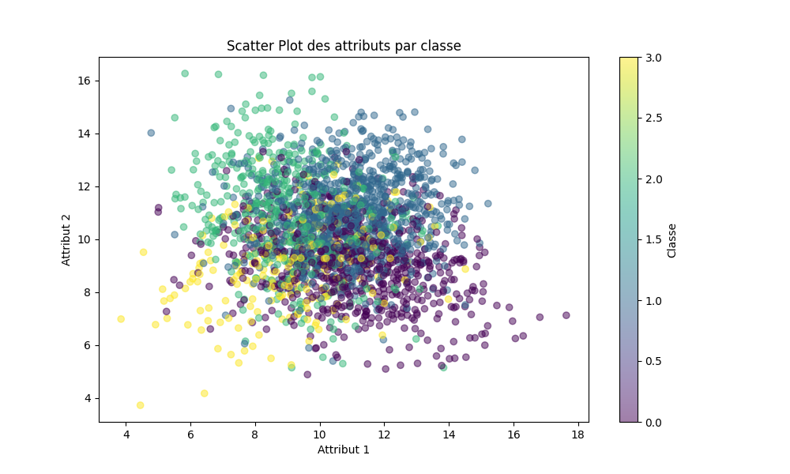

---
title: Concevoir, analyser et comparer des modèles d'apprentissage automatique.
author: ANTOINE Marcoly & DIALLO Abdoul Aziz
date: 20/04/2024
...

# 1 - Préparation des données

1. Ces données comporte 14 attributs au total comme le montre `data.shape[1]`.

   - Les en-têtes de colonnes de la première ligne du fichier listent 14 attributs de Attr_A à Attr_N et un label Class.

2. Le nombre de classe différente dans les données est : 4

3. Voici une statistique simplifiée de nos données :

   | Classe | Nombre d'instances |
   | :----: | :----------------: |
   |   0    |        674         |
   |   1    |        908         |
   |   2    |        472         |
   |   3    |        244         |

4. Non, si on observe le schéma 1 on voit que les données ne le sont pas.
   De plus si l'on choisit de les ranger par classe , on peut voir clairement que ce n'est pas divisible linéairement à l'état brut.

   

5. - Pour l'arbre de décision
     Puisque les variables sont déjà numériques et que la colonne Class est utilisée comme étiquette (et non comme une fonctionnalité), aucun encodage One-hot n'est nécessaire pour les fonctionnalités. Si Class était utilisée comme une caractéristique d'entrée plutôt que comme une étiquette, et si elle comprenait de nombreuses catégories différentes, l'encodage One-hot pourrait être envisagé pour éviter de donner un ordre artificiel entre les catégories.
     Pour un modèle basé sur un arbre de décision, la normalisation des données n'est généralement pas nécessaire. Les arbres de décision ne sont pas sensibles à la magnitude des valeurs des attributs de la même manière que le sont les modèles basés sur des calculs de distance ou des modèles linéaires. Voici pourquoi :

   - Pour les réseaux de neurones : l'encodage one-hot est nécéssaire de manière à dissoier les sorties de classe

6. Séparer les données en jeu d'entraînement et jeu de test permet d'évaluer la performance du modèle de manière impartiale, de détecter le surapprentissage et d'obtenir des prédictions plus précises sur des données nouvelles.

# Mise en oeuvre des modèles

Les _quartiles_ sont des valeurs qui divisent les données en quatre parties égales lorsqu'elles sont triées dans l'ordre croissant. Plus précisément, les quartiles sont les valeurs situées à 25 %, 50 % et 75 % de l'ensemble de données ordonné. Voici les trois quartiles couramment utilisés :

- **Premier quartile (Q1)** : également appelé le quartile inférieur, il est la valeur qui se situe au 25 % inférieur des données ordonnées.
- **Deuxième quartile (Q2)** : également appelé la médiane, c'est la valeur qui divise les données en deux moitiés égales (50 %).
- **Troisième quartile (Q3)** : également appelé le quartile supérieur, il est la valeur qui se situe au 75 % des données ordonnées.

Les quartiles sont des mesures de tendance centrale qui fournissent des informations sur la dispersion et la répartition des données.

Pour les calculer nous avons utilisé la méthode `quantile()` sur la série des données d'un attribut spécifique. Pour donner un exemple sur l'attribut A.

```python
attribute = 'Attr_A'

# Calculer les quartiles pour l'attribut choisi
quartiles = data[attribute].quantile([0.25, 0.5, 0.75])

# Afficher les quartiles
print(f"Quartile 1 (Q1) de l'attribut '{attribute}': {quartiles[0.25]}")
print(f"Médiane (Q2) de l'attribut '{attribute}': {quartiles[0.5]}")
print(f"Quartile 3 (Q3) de l'attribut '{attribute}': {quartiles[0.75]}")
```

# 3. Analyse des modèles

| Classes   | C1     | C2     | C3     | C4     |
| --------- | ------ | ------ | ------ | ------ |
| Accuracy  | valeur | valeur | valeur | valeur |
| Precision | valeur | valeur | valeur | valeur |
| Recall    | valeur | valeur | valeur | valeur |
| F1-score  | valeur | valeur | valeur | valeur |

|        | Predicted label 0 | Predicted label 1 | Predicted label 2 | Predicted label 3 |
| ------ | ----------------- | ----------------- | ----------------- | ----------------- |
| True 0 |                   |                   |                   |                   |
| True 1 |                   |                   |                   |                   |
| True 2 |                   |                   |                   |                   |
| True 3 |                   |                   |                   |                   |

# 4. Le meilleur modèle
